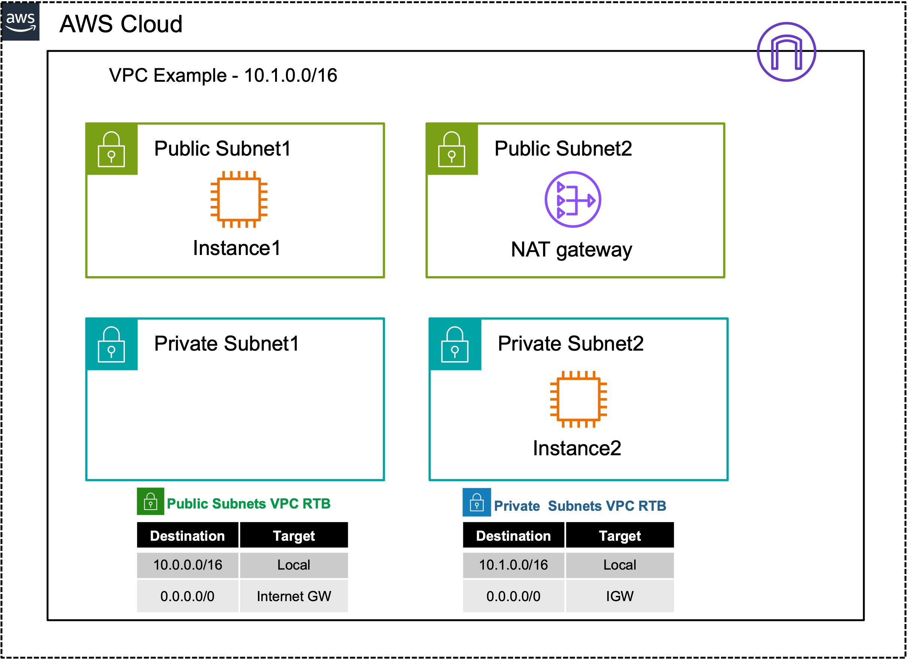
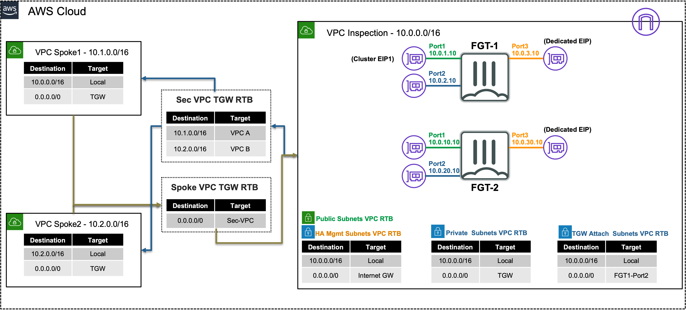

# FortiGate: Protecting AWS Resources

## Learning Objectives

At the end of this workshop, you will complete the following objectives:
  
  * Understand AWS Networking Concepts *(10 minutes)*
  * Understand AWS Common Architecture Patterns *(10 minutes)*
  * Understand FortiGate FortiOS terminology *(10 minutes)*
  * Use Firewall policies with security profiles & objects to control traffic *(10 minutes)*
  * Test traffic flows to validate the implemented networking and security controls *(20 minutes)*

## Workshop Components

These are the AWS and Fortinet components that will be used during this workshop:

  * FortiGate Instances running FortiOS
  * AWS EC2 Instances (Amazon Linux OS)
  * AWS SDN (AWS intrinsic router and route tables in a VPC)
  * AWS Transit Gateway (TGW)

## AWS Reference Architecture Diagram

This is the architecture and environment that will be used in the workshop.

  * With AWS networking there are several different ways to organize your AWS architecture to take advantage of FortiGate traffic inspection. The important point to know is that as long as the traffic flow has a symmetrical routing path (for forward and reverse flows), the architecture will work. These diagrams highlight architecture patterns:

  * **Ingress + Egress in a single VPC**
  * **Centralized Inspection of Ingress + Egress + East-West with multiple VPCs**

