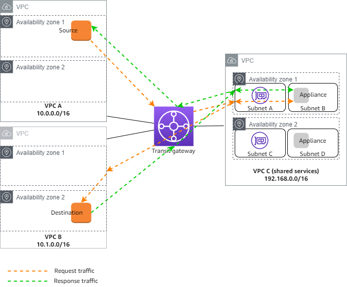

Before diving into the reference architecture for this workshop, let's review core AWS networking concepts. **Click the hyperlinks for AWS documentation**.

[**Virtual Private Cloud (VPC)**](https://docs.aws.amazon.com/vpc/latest/userguide/how-it-works.html) is a logically isolated section of the AWS Cloud where you can launch AWS resources in a virtual network that you define. You have complete control over your virtual networking environment, including selection of your own IP address range, creation of subnets, and configuration of route tables and network gateways.

[**Region**](https://docs.aws.amazon.com/AWSEC2/latest/UserGuide/using-regions-availability-zones.html#concepts-regions) is a collection of multiple Availability Zones in a geographic location. The collection of AZs in the same region are all interconnected via redundant, ultra-low-latency networks.

[**Availability Zones (AZ)**](https://docs.aws.amazon.com/AWSEC2/latest/UserGuide/using-regions-availability-zones.html#concepts-availability-zones) are multiple, isolated datacenter locations within each Region that have independent power, cooling, physical security, etc. A VPC spans all of the AZs in the Region.

All [**subnets**](https://docs.aws.amazon.com/vpc/latest/userguide/configure-subnets.html) within a VPC are able to reach each other with the default or intrinsic router within the VPC. All resources in a subnet use the intrinsic router (1st host IP in each subnet) as the default gateway. Each subnet must be associated with a VPC route table, which specifies the allowed routes for outbound traffic leaving the subnet. Subnets are tied to a single AZ.

[**Internet Gateway (IGW)**](https://docs.aws.amazon.com/vpc/latest/userguide/VPC_Internet_Gateway.html) is a horizontally scaled, redundant, and highly available VPC component that allows communication between instances in your VPC and the internet. It therefore imposes no availability risks or bandwidth constraints on your network traffic.

[**Elastic IP (EIP)**](https://docs.aws.amazon.com/vpc/latest/userguide/vpc-eips.html) is a static IPv4 address designed for dynamic cloud computing within a region. Simply allocate one to a region in your account and associate this to an EC2 instance to access it over the public internet.

[**NAT Gateway (NAT GW)**](https://docs.aws.amazon.com/vpc/latest/userguide/vpc-nat-gateway.html) is a Network Address Translation (NAT) service. You can use a NAT gateway so that instances in a private subnet can connect to services outside your VPC but external services cannot initiate a connection with those instances.

[**VPC Peering**](https://docs.aws.amazon.com/vpc/latest/peering/vpc-peering-basics.html) is a private and point to point connection between two VPCs. While you can connect many VPCs together in the same region, **VPC peering does not support transitive routing**. In the diagram below, VPC A has peering connections to both VPC B & C, so A can talk to B or C. However, VPC B can't talk to VPC C, and the reverse as well, unless you setup a VPC peering connection directly between them. As VPCs scale, it is better to use Transit Gateway instead.

[**Transit Gateway (TGW)**](https://docs.aws.amazon.com/vpc/latest/tgw/how-transit-gateways-work.html) is a highly scalable cloud router that connects your VPCs in the same region to each other, to on-premise networks, and even to the internet through one hub. With the use of multiple route tables for a single TGW, you can design hub and spoke routing for traffic inspection and enforcement of security policy across multiple VPCs. As the name implies, [**Transit Gateway supports transitive routing**](https://docs.aws.amazon.com/vpc/latest/tgw/TGW_Scenarios.html).

In this workshop we will use these components to highlight using FortiGates in an enterprise design. 
