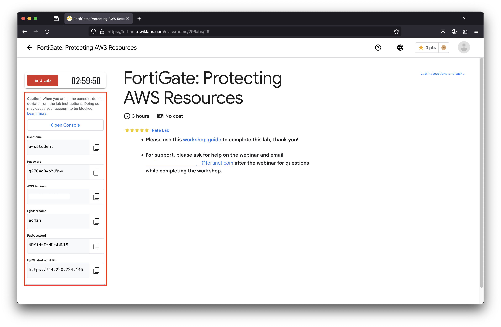

## Accessing QwikLabs & AWS environment

Fortinet Cloud Workshops, will use [**QwikLabs**](https://fortinet.qwiklabs.com/paths) to provide a pre-staged AWS account with the workshop environment.

- Upon login, click **Explore** (top of page).
- Look for **FortiGate: Protecting AWS Resources**.
- Click the green **Start Lab** button to begin.

{}
This environment will run for 90 minutes and then automatically clean up and shutdown all resources.  If you restart the lab, then you will start with a clean environment where you will start from the beginning again.
{}

**Once the environment has finished provisioning, check the QwikLabs Console left menu to find FortiGate NGFW & AWS console login URL and credentials .**

