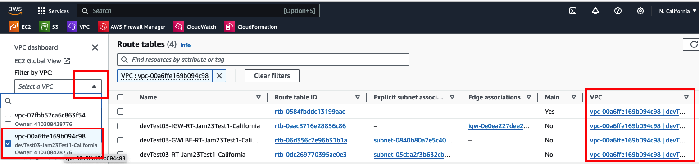
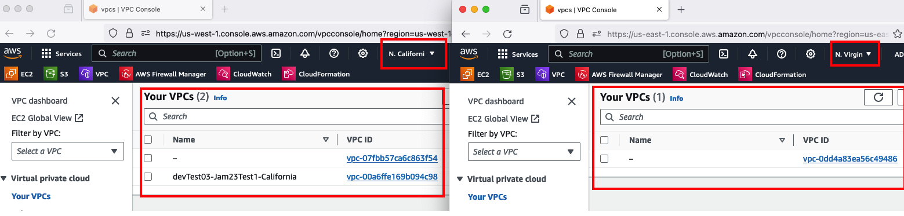

## Helpful tips when working with AWS console

### General
- Its often helpful to open each new service in its own tab.  That way, you can refer back to each service independently without losing the info on your screen.
  - This trick is also useful when working in multiple regions.  Just be careful you make a change in the appropriate region!
- Search/filter within a service
  - Often, when working with AWS services, it can be confusing matching a particular item to its "owner"
    - e.g.  Every Subnet and RT belongs to a single VPC.
    - Identifying a specific RT from a long list of all RT in a region can be difficult
    - You can use the filters in leftnav, or top-middle search bar to filter and narrow down the viewable items
    - In the VPC Dashboard, you can filter subnets or RT to a specific VPC to help more easily identify the one you need
     
- Working in different AWS regions
  - The AWS console displays services for 1 Region only.
  - If you need to work with resources in different regions, you can open multiple browser tabs to view Service consoles in different regions
  - The example below shows VPCs in US-WEST-1(N. California) & US-East-1(N. Virginia)
  - Be careful when working between regions, ensuring you make changes to the appropriate region's services
   

