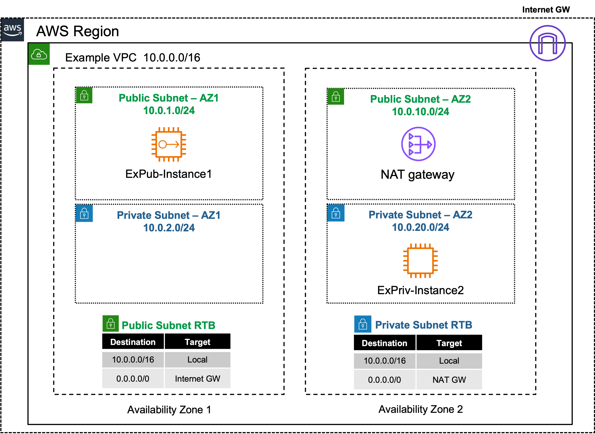
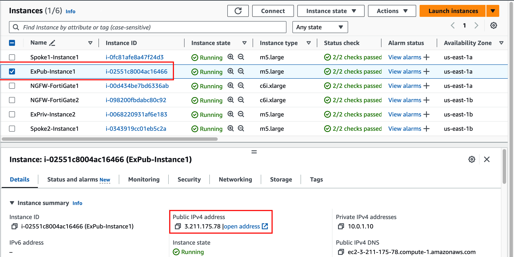
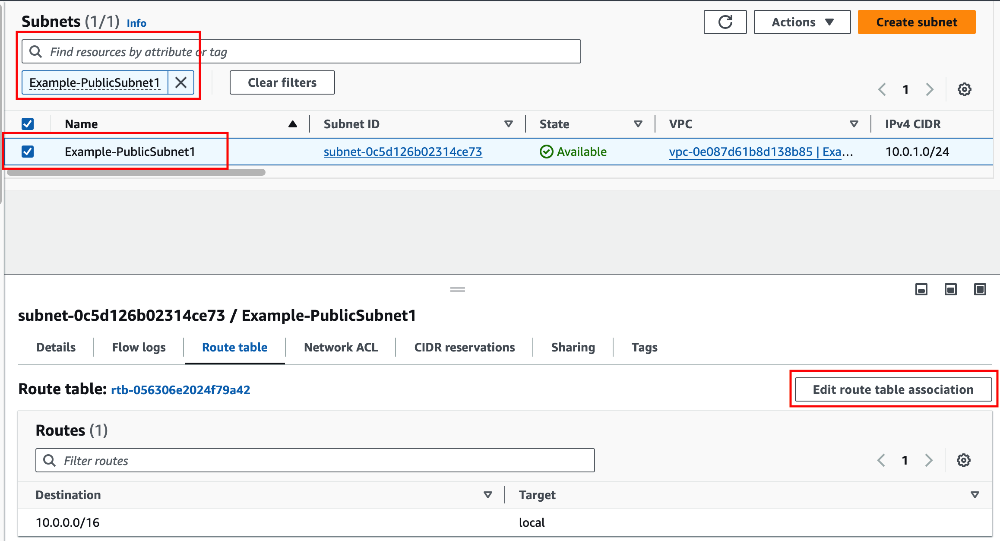
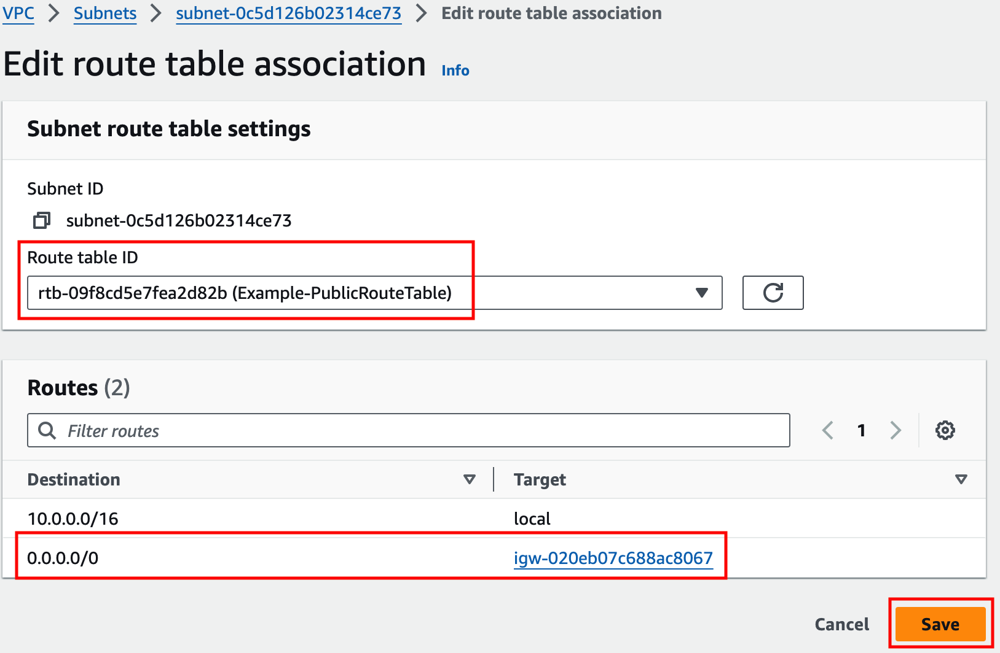
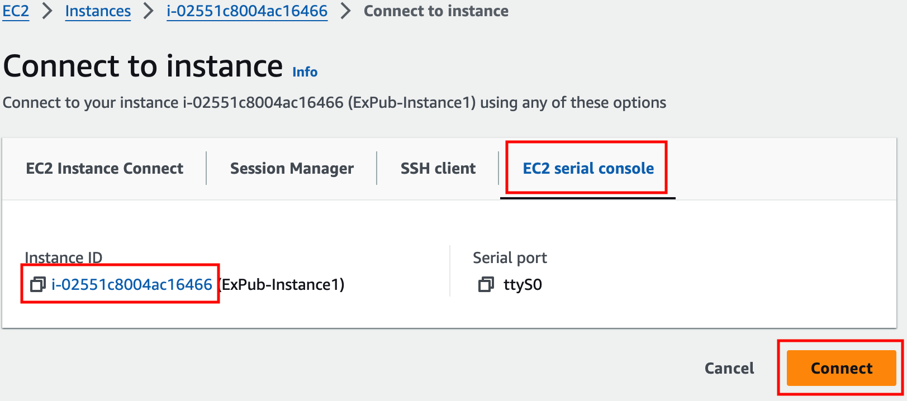

## Task 1: Public Inbound

- 1. In your AWS account, navigate to the **EC2 Console** and go to the **Instances page**. Find the **ExPub-Instance1** instance. In your command prompt or terminal, ping the **public IPv4 address** of the instance. This should not work at this point.

- 2. Navigate to the **VPC Console** and go to the **Subnets page**. Find the **Example-PublicSubnet1** subnet. Select the **Route table tab** and click **Edit route table association**. On the next page, select the **Example-PublicRouteTable** and click **save**.

- 3. Now you can successfully ping the **public IPv4 address** of the **ExPub-Instance1** instance. Let's dig deeper to understand how all of this works. In the **EC2 Console** go to the **Instances page** select the **ExPub-Instance1** instance and click **Connect > EC2 serial console**. Copy the instance ID as this will be the username and click connect. Login to the instance with the instance ID as the username and **`FORTInet123!`** as the password.

- 3. Run the command **`ifconfig eth0`** and take note of the instance IPv4 address. Then run the command **`curl ipinfo.io`**.

{}
The instance has the private IP 10.0.1.10/24, but is reachable by and seen as the associated public IP. This is because an [Elastic IP (EIP)](https://docs.aws.amazon.com/vpc/latest/userguide/vpc-eips.html) is a 1 to 1 NAT service provided by the [AWS Internet Gateway (IGW)](https://docs.aws.amazon.com/vpc/latest/userguide/VPC_Internet_Gateway.html).
{}

- 4. Run the command **`route -n`** and take note of the default route and the gateway IP for that route.

{}
The instance has a default route going to the private IP of 10.0.1.1. This is the AWS VPC router (aka intrinsic router), which is the first host IP in any subnet within a VPC. Reference this [AWS document](https://docs.aws.amazon.com/vpc/latest/userguide/subnet-sizing.html#subnet-sizing-ipv4) to learn what other IPs in a subnet are always used by AWS.
{}

- 5. The VPC route table that you assigned to the public subnet has a default route to the internet through the AWS Internet Gateway (IGW). Also this instance has an Elastic IP (EIP), a public IP, associated to it. These AWS Networking components are allowing the public inbound access to work successfully for this instance.

**This concludes this task**
