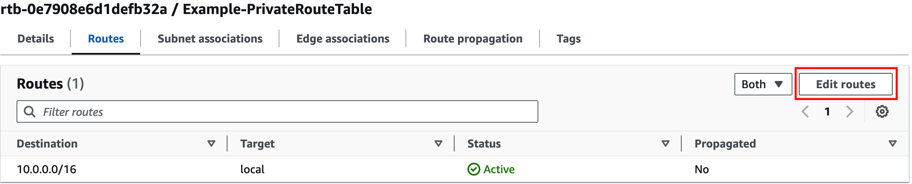
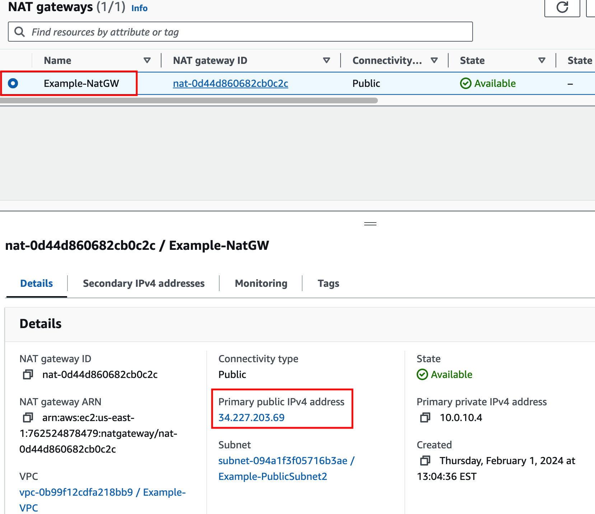

## Private Outbound: Single VPC with NATGW 
- Goal: Establish Outbound only Internet access for EC2 Private instance
- Task: Adjust the Route table associations so ExPriv-Instance1 can reach the Internet

{} 

There are no security controls in this example.  However, NATGW is a 1-way service, only allowing connectivity Outbound.  While ExPriv-Instance2 can freely browse the Internet (Outbound), no Internet hosts can connect to it (Inbound)

{}

#### Summarized Steps (click to expand each for details)

1. Login to **ExPriv-Instance2** and verify it cannot access the Internet

    {}
- **1.1:** In the **EC2 Console** go to the **Instances page** select the **ExPriv-Instance2** instance
  
- **1.2:** click **Connect > EC2 serial console**
    - Copy the instance ID as this will be the username and click connect. 
- **1.3:** Login to the EC2 instance:
    - username: <<copied Instance ID from above>>
    - Password: **`FORTInet123!`
- **1.4:** Run the command **`ping -c5 8.8.8.8`** to connect to public resources
  - This **SHOULD NOT** work at this point.

   {}

2. Identify the relevant route table and add proper routes so 0.0.0.0/0 traffic is sent to **NATGW** 

    {}

- **2.1:** Navigate to the **VPC Console** and go to the **Subnets page**.
- **2.2:** Find the **Example-PrivateSubnet2** subnet
- **2.3:** Select the **Route table tab** and click the actual route table name **rtb-.... / Example-PrivateRouteTable**.
  
- **2.4:** Select the **Example-PublicRouteTable** route and click **Edit routes**
  
- **2.5:** Add a default route (ie **0.0.0.0/0**) with a target of the **NAT Gateway** and click **Save changes**.
  

    {}

3. Test Internet connectivity from **ExPriv-Instance2** again

    {}

- **3.1:** Go back to the EC2 serial console and rerun the command **`ping -c5 8.8.8.8`** to connect to public resources successfully. 

  - Let's dig deeper to understand how all of this works. 
- **3.2:** Run the command **`ifconfig eth0`** and take note of the instance IPv4 address. 
- **3.3:** Run the command **`curl ipinfo.io`**.

{}
The instance has the private IP 10.0.20.10/24, but is and seen as coming from a public IP. This is because a [NAT Gateway](https://docs.aws.amazon.com/vpc/latest/userguide/vpc-nat-gateway.html) is providing outbound access to the internet for this private EC2 instance.
{}

- **3.4:** In the **VPC Console** go to the **Nat gateways** page. 
- **3.5:** Find the "Example-NatGW" NAT Gateway and notice the public IP from the curl output matches the primary public IPv4 address assigned to NATGW. 
  - The NAT Gateway is deployed in the **Example-PublicSubnet2** subnet which has a route to the Internet through the [AWS Internet Gateway (IGW)](https://docs.aws.amazon.com/vpc/latest/userguide/VPC_Internet_Gateway.html)
  - These AWS Networking components are allowing private outbound access to work successfully for this instance.

    

    {}

### Discussion Points
- NAT GW providing many to 1 NAT, for outbound only
- No internal reachability via NATGW, so no inbound probes seen on any of the private instances 
- General best practice, though thoroughly insufficient for overall security principles
  
**This concludes this task**
