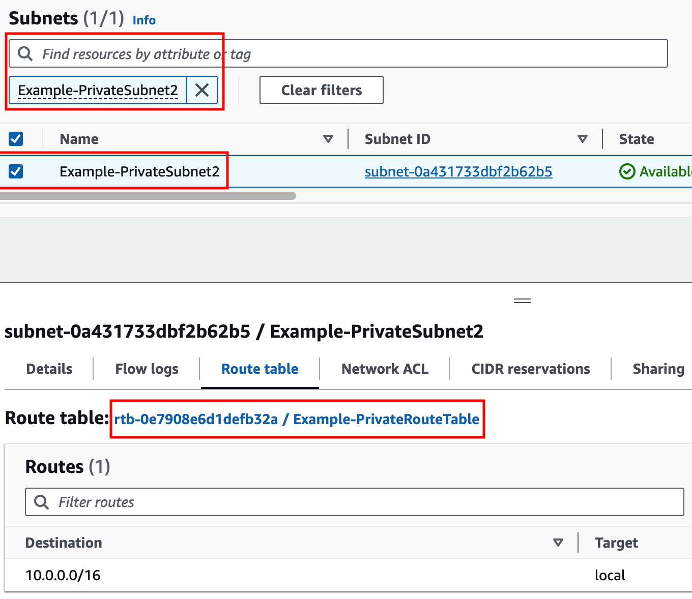
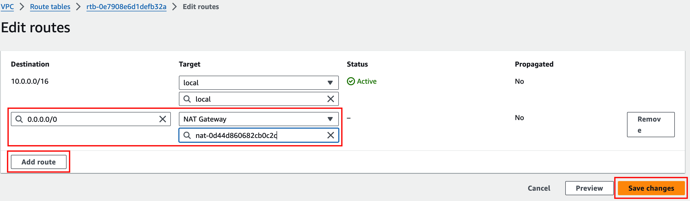

## Task 2: Private Outbound

- 1. Navigate to the **EC2 Console** and go to the **Instances page**. Find the **ExPriv-Instance2** instance. Select the instance and click **Connect > EC2 serial console**. Copy the instance ID as this will be the username and click connect. Login to the instance with the instance ID as the username and **`FORTInet123!`** as the password. Run the command **`ping -c5 8.8.8.8`** to connect to public resources. This should not work at this point.

- 2. Navigate to the **VPC Console** and go to the **Subnets page**. Find the **Example-PrivateSubnet2** subnet. Select the **Route table tab** and click the actual route table name **rtb-.... / Example-PrivateRouteTable**. On the next page, select the **Example-PublicRouteTable** route and click **Edit routes**. On the next page, add a default route (ie **0.0.0.0/0**) with a target of the **NAT Gateway** and click **Save changes**.

- 3. Go back to the EC2 serial console and rerun the command **`ping -c5 8.8.8.8`** to connect to public resources successfully. Let's dig deeper to understand how all of this works. Run the command **`ifconfig eth0`** and take note of the instance IPv4 address. Then run the command **`curl ipinfo.io`**.

{}
The instance has the private IP 10.0.20.10/24, but is and seen as coming from a public IP. This is because a [NAT Gateway](https://docs.aws.amazon.com/vpc/latest/userguide/vpc-nat-gateway.html) is providing outbound access to the internet for this private EC2 instance.
{}

- 4. In the **VPC Console** go to the **Nat gateways** page. Find the "Example-NatGW" NAT Gateway and notice your public IP seen in your curl output matches the primary public IPv4 address assigned to it. The NAT Gateway is deployed in the **Example-PublicSubnet2** subnet which has a route to the internet through the [AWS Internet Gateway (IGW)](https://docs.aws.amazon.com/vpc/latest/userguide/VPC_Internet_Gateway.html). These AWS Networking components are allowing the private outbound access to work successfully for this instance.

**This concludes this task**
