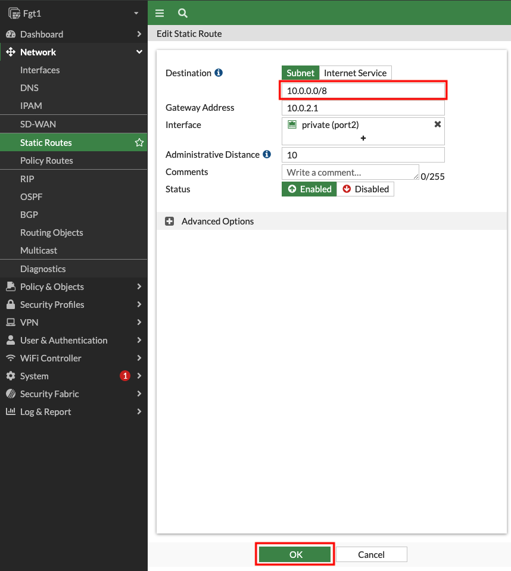
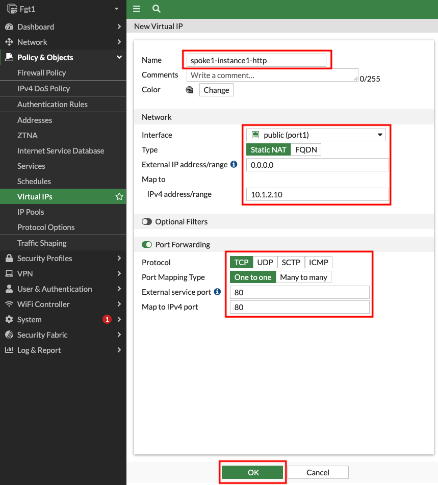
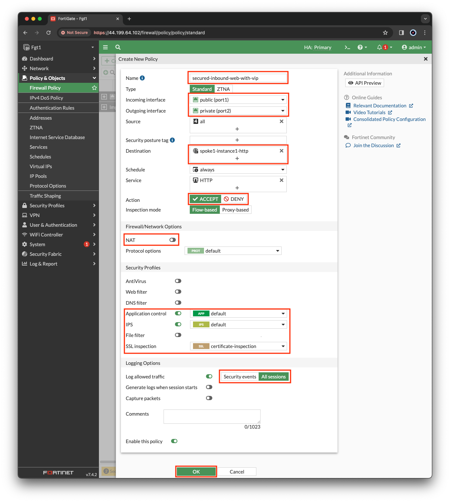

## FortiGate Security VPC in Centralized Architecture with TGW 
- Goal: Utilize the provisioned Security VPC and Transit gateway architecture to provide security for inbound flows with FortiGate NGFW.
- Task: Create FortiGate VIP and Policy rule allowing inbound traffic to web servers.

#### Summarized Steps (click to expand each for details)

1. Login for FortiGate GUI and add a VIP.

    {}

- **1.1:** Login to the FortiGate GUI, using the **Fgt** outputs in the QwikLabs Console.
  - The **fgtclusterurl, fgtuser, and fgtpassword** outputs will be available on the left side of the Qwiklabs console. 
- **1.2:** Upon login, navigate to **Network > Static Routes**.
- **1.3:** Edit the existing route to **10.0.0.0/16**.
  - This route needs to be updated to allow access to both the Spoke VPCs that are part of this centralized design. Change the destination to **10.0.0.0/8** and click **OK** to save the change.

- **1.4:** Navigate to **Policy & Objects > Virtual IPs**, and click **Create new**.
- **1.5:** Create a VIP with the **settings shown below** and click **OK**.

    {}

2. Add a Firewall Policy allowing inbound traffic to the newly created VIP.

    {}

- **2.1:**  Navigate to **Policy & Objects > Firewall Policy** and click **Use new layout when prompted**, then click **Create new**. 

{}
If you accidentally did not use the new layout, you can change it by clicking on **Classic Layout** in the top right and switch to **Use new layout**.
{}

- **2.2:** Create a new policy with the **settings shown below** and click **OK** to allow inbound HTTP to Spoke1-Instance1.

{}
Please make sure to **disable NAT** so the web server can see your public IP instead of a private IP of the primary FortiGate.
{}

    {}

3.  Test the newly created VIP & policy.

    {}

- **3.1:** Open a new browser tab on your workstation and browse to **http://**FgtClusterLoginURL****. 
  - You should see a web page showing details about **Spoke1-Instance1**.
  - If NAT was disabled, **you should see your public IP** on the web page.

    {}
  
4. Let's dig deeper to understand how all of this works.

    {}

- **4.1:** In the FortiGate GUI navigate to **Log & Report > Forward Traffic** and you should see logs for the traffic you generated. 
- **4.2:** **Double click** a log entry to view the **Log Details**.

{}
In the **Source section** of the log, we see the original public IP and country/region of the client. In the **Destination section**, we see that the original destination is the private IP of port1 of the primary FortiGate. This is because the public IP you navigated to is an Elastic IP (EIP) which is a 1 to 1 NAT service provided by the [AWS Internet Gateway (IGW)](https://docs.aws.amazon.com/vpc/latest/userguide/VPC_Internet_Gateway.html). We also see the destination NAT IP is the private IP of Spoke1-Instance1 because of the [VIP object](https://fortinetcloudcse.github.io/FGCP-in-AWS/7_usecases/71_usecase1.html) that was matched.

In the **Application Control section** we can see details about the browser used. Navigate to the **Security tab** of the Log Details and you can see detailed user agent information as well.
{}

- **4.3:** Navigate to the **EC2 Console** and go to the **Instances page** (menu on the left).
- **4.4:** Find and select the **Spoke1-Instance1** instance then click **Connect > EC2 serial console**.
  - **Copy the instance ID** as this will be the username and click connect. 
- **4.5:** Login to the EC2 instance:
    - username: `<<copied Instance ID from above>>`
    - Password: **`FORTInet123!`**
- **4.6:** Run the commands **`ping -c5 8.8.8.8`** and **`curl ipinfo.io`** to connect to public resources, successfully. 
- **4.7:** To test downloading an EICAR test virus over HTTPS to a local file, run the command **`curl -k --retry 2 --retry-all-errors https://secure.eicar.org/eicar.com.txt -o file.txt`**.
- **4.8:** To check the content of the file, run the command **`cat file.txt | grep -A 15 'High Security Alert'`**.
  - You will see you were blocked and a block page was returned.

    {}
 
5. Let's dig deeper to understand how all of this works.

    {}

- **5.1:** In the FortiGate GUI navigate to **Log & Report > Forward Traffic**.  You should logs for the traffic you generated. 
- **5.2:** **Double click** a log entry to view the **Log Details**.

{}
The instance has the private IP 10.1.2.10/24, but is seen as coming from a public IP. This is because the primary FortiGate is providing secured outbound access to the internet for this private EC2 instance. This is because of the **VPC routes in all the VPCs (Spoke1 and NGFW) are working together with the Transit Gateway (TGW) and Transit Gateway route tables to route** the in/outbound traffic through the primary FortiGate. This is a [**centralized design**](https://docs.aws.amazon.com/vpc/latest/tgw/transit-gateway-appliance-scenario.html) that is also commonly called an appliance, inspection, or security VPC.

Navigate to **Policy & Objects > Firewall Policy** and look at the **security profiles** being applied to the **secured-outbound-traffic-with-nat policy**. This pre-configured policy is applying source NAT to act as a NAT Gateway but is also applying advanced NGFW protection such as SSL MitM, Application Control, Intrusion Prevention, and Anti-Virus features.
{}

    {}

### Discussion Points
- TGW handles inter-VPC routing for full-mesh connectivity.
- Centralized Security VPC handles FortiGate NGFW inspection for any traffic flow (Inbound, Outbound, East/West).
  - advanced architectures for all of these scenarios can be [found here](https://github.com/FortinetCloudCSE/.github/blob/main/profile/AWS/README.md).

**This concludes this task**
