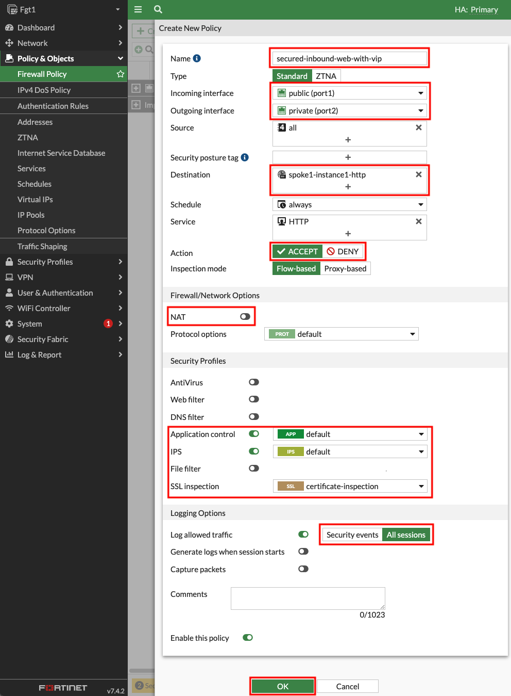

## Task 3: Secured Inbound & Outbound

- 1. Login to the FortiGate GUI, using the **Fgt** outputs in the QwikLabs Console. The fgtclusterurl, fgtuser, and fgtpassword outputs will be available on the left side of the Qwiklabs console. **You will be prompted to change the password, please don't lose  or forget it** :smile:. Navigate to **Network > Static Routes** and edit the existing route to **10.0.0.0/16**. This route needs to be updated to allow access to both the Spoke VPCs that are part of this centralized design. Change the destination to **10.0.0.0/8** and click **OK** to save the change.

- 2. Navigate to **Policy & Objects > Virtual IPs**, and click **Create new**. Create a VIP with the **settings shown below** and click **OK**.

{}
Please make sure to **disable NAT** so the web server can see your public IP instead of a private IP of the primary FortiGate.
{}

- 3. Navigate to **Policy & Objects > Firewall Policy** and click **Use new layout when prompted**, then click **Create new**. Create a new policy with the **settings shown below** and click **OK** to allow inbound HTTP to Spoke1-Instance1.

{}
If you accidentally did not use the new layout, you can change it by clicking on **Classic Layout** in the top right and switch to **Use new layout**.
{}

- 4. Open a new browser tab and navigate to the public IP seen in the **FgtClusterLoginURL** but **do this over HTTP**. You should load the web page showing details about **Spoke1-Instance1**. Let's dig deeper to understand how all of this works.

- 5. In the FortiGate GUI navigate to **Log & Report > Forward Traffic** and you should logs for the traffic you generated. **Double click** a log entry to view the **Log Details**.

{}
In the **Source section** of the log, we see the original public IP and country/region of the client. In the **Destination section**, we see that the original destination is the private IP of port1 of the primary FortiGate. This is because the public IP you navigated to is an Elastic IP (EIP) which is a 1 to 1 NAT service provided by the [AWS Internet Gateway (IGW)](https://docs.aws.amazon.com/vpc/latest/userguide/VPC_Internet_Gateway.html). We also see the destination NAT IP is the private IP of the poke1-Instance1 because of the [VIP object](https://fortinetcloudcse.github.io/FGCP-in-AWS/7_usecases/71_usecase1.html) that was matched.

In the **Application Control section** we can see details about the browser used. Navigate to the **Security tab** of the Log Details and you can see detailed user agent information as well.
{}

- 6. Navigate to the **EC2 Console** and go to the **Instances page**. Find the **Spoke1-Instance1** instance. Select the instance and click **Connect > EC2 serial console**. Copy the instance ID as this will be the username and click connect. Login to the instance with the instance ID as the username and **`FORTInet123!`** as the password. Run the commands **`ping -c5 8.8.8.8`** and **`curl ipinfo.io`** to connect to public resources, successfully. To test downloading an eicar test virus over HTTPS, run the command **`curl -k https://secure.eicar.org/eicar.com.txt`** and you will be blocked and see a long HTML block page returned. Let's dig deeper to understand how all of this works.

- 7. In the FortiGate GUI navigate to **Log & Report > Forward Traffic** and you should logs for the traffic you generated. **Double click** a log entry to view the **Log Details**.

{}
The instance has the private IP 10.1.2.10/24, but is and seen as coming from a public IP. This is because the primary FortiGate is providing secured outbound access to the internet for this private EC2 instance. This is because of the **VPC routes in all the VPCs (Spoke1 and NGFW) are working together with the Transit Gateway (TGW) and Transit Gateway route tables to route** the in and outbound traffic through the primary FortiGate. This is a [**centralized design**](https://docs.aws.amazon.com/vpc/latest/tgw/transit-gateway-appliance-scenario.html) that is also commonly called an appliance, inspection, or security VPC.

Navigate to **Policy & Objects > Firewall Policy** and look at the **security profiles** being applied to the **secured-outbound-traffic-with-nat policy**. This pre-configured policy is applying source NAT to act as a NAT Gateway but is also applying advanced NGFW protection such as SSL MitM, Application Control, Intrusion Prevention, and Anti-Virus features.
{}

**This concludes this task**
