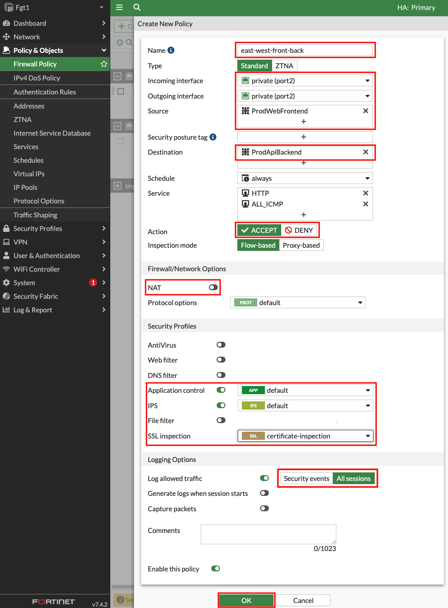

## Task 4: Secured East West

- 1. In the FortiGate GUI, navigate to **Policy & Objects > Addresses**, and click **Create new**. Create an address object with the **settings shown below** and click **OK**.

Name | Type | Sub Type | SDN Connector | Address Type | Filter Value
---|---|---|---|---|---
ProdWebFrontend | Dynamic | Fabric Connector Address | aws-instance-role | Private | Tag.env=prod AND Tag.app-role=web AND Tag.app-tier=frontend
ProdApiBackend | Dynamic | Fabric Connector Address | aws-instance-role | Private | Tag.env=prod AND Tag.app-role=api AND Tag.app-tier=backend

- 2. Navigate to **Policy & Objects > Firewall Policy** and click **Create new**. Create a new policy with the **settings shown below** and click **OK** to allow east west traffic from Spoke1-Instance1 to Spoke2-Instance1.

- 3. Navigate to the **EC2 Console** and go to the **Instances page**. Find the **Spoke1-Instance1** instance. Select the instance and click **Connect > EC2 serial console**. Copy the instance ID as this will be the username and click connect. Login to the instance with the instance ID as the username and **`FORTInet123!`** as the password. Run the commands **`ping -c5 10.2.20.10`** and **`curl 10.2.20.10`** to connect to private resources, successfully.  Next, run the command **`ssh 10.2.20.10`** to be blocked by firewall policy. Let's dig deeper to understand how all of this works.

- 4. Navigate to **Log & Report > Forward Traffic** and you should logs for the traffic you generated. **Double click** a log entry to view the **Log Details**.

{}
In the **Source and Destination sections** of the log, we see the no NAT is applied and traffic comes in and goes out port2 of the Primary FortiGate. This is because of the VPC routes in the all VPCs (Spoke1, NGFW, and Spoke2)** are working together with the Transit Gateway (TGW) and Transit Gateway route tables to route the east west traffic through the primary FortiGate.  This is a [**centralized design**](https://docs.aws.amazon.com/vpc/latest/tgw/transit-gateway-appliance-scenario.html) that is also commonly called an appliance, inspection, or security VPC.

We can also see denied traffic that is matching the **Implicit Deny** firewall policy.  With adding granular firewall policies & objects including dynamic address objects and security profiles, you can securely control traffic as desired.
{}

**This concludes this task**
