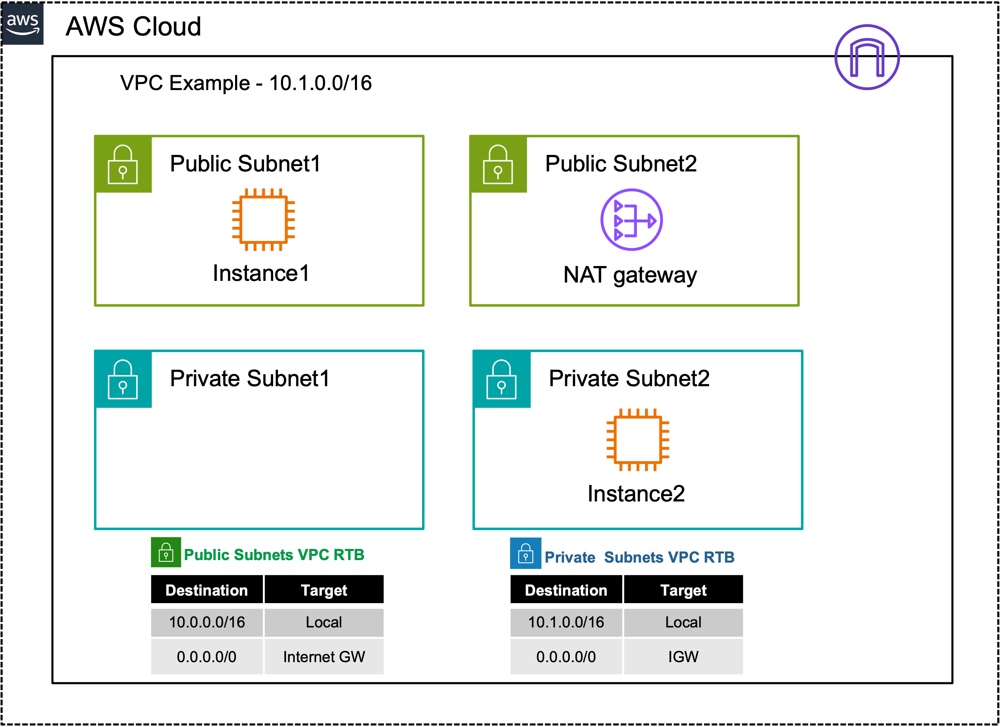

# AWS Foundational Networking: 

In this section, we'll learn about Single VPC traffic flows.  

- AWS defines a subnet as public if its instances use an Elastic IP (EIP) and have direct inbound & outbound access to the Internet

  1. [Public In/Outbound Internet flows w/ IGW](4_modulefour/41_task1.html)

- AWS defines a subnet as private if its instances use a NAT Gateway (NATGW) for outbound-only Internet access  

  2. [Private Outbound Internet flows w/ NATGW](4_modulefour/42_task2.html)

