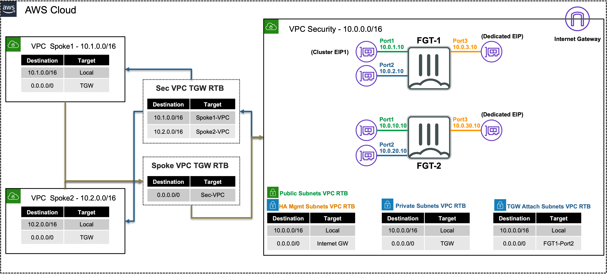

# Securing Flows with FortiGate

In this section we'll work with a FortiGate Secured Centralized VPC and Transit Gateway connectivity

- Centralized VPC can secure inbound and outbound traffic from VPC's attached to a Transit Gateway (TGW)

  3. [Centralized In & outbound Internet Flows](5_modulefive/53_task3.html)

- Centralized VPC can secure East/West traffic between VPC's attached to a Transit Gateway (TGW)

   4. [East-West Inter VPC flows](5_modulefive/54_task4.html)
  
   