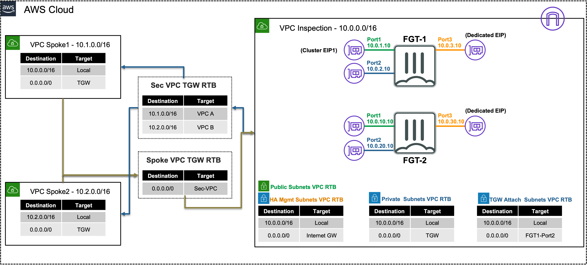

# Welcome!

AWS Software-Defined Networking (SDN) is elastic, complex, and quite different than traditional on-premise networking. In this workshop you will learn how to use FortiGate instances to protect your AWS workloads deployed in common architecture patterns.

This workshop is intended to help accomplish the following:

  * Learn foundational AWS networking concepts such as routing traffic in and out of VPCs for various traffic flows
  * Use FortiGate instances to secure inbound, outbound, and East-West traffic flows
  * Introduction to centralized AWS architectures with Transit Gateway
